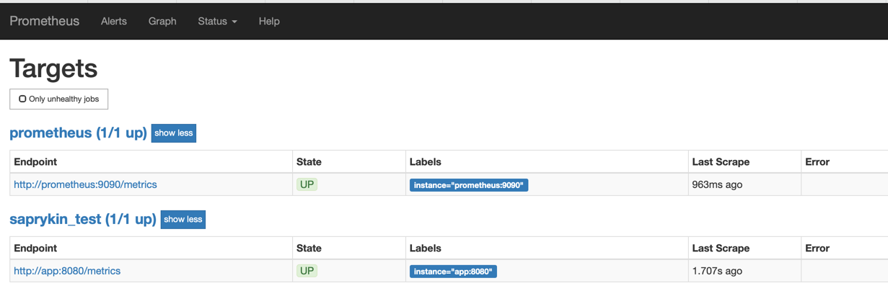

# Saprykin Test Docker compose
* `helm version: v3.8.1`
* `docker version: v20.10.11`
* `docker-compose version: v1.29.2`
* `minikube version: v1.24.0`
## How to run Docker 
```shell
docker-compose up -d
```
## Grafana
Then open <http://localhost:3000/d/_eM23sd2> in your browser to see th

## Prometheus

## App
Then open <http://localhost:8080/hello in your browser to see the app.
## Health
Then open <http://localhost:8080/health in your browser to check the health OK.
## Generator
Generate traffic on app endpoints
## Clean
Don't forget to shut the demo down, once finished:
```shell
docker-compose down -v --rmi all
```

## How to run MiniKube
* minikube start `run minikube`
* minikube status `check status`
* minikube dashboard `run dashboard`
* minikube addons enable ingress `run ingress`
* helm install ./saprykin-test-app
* minikube service svc-saprykin-test-app --url 
* minikube service svc-grafana --url 

